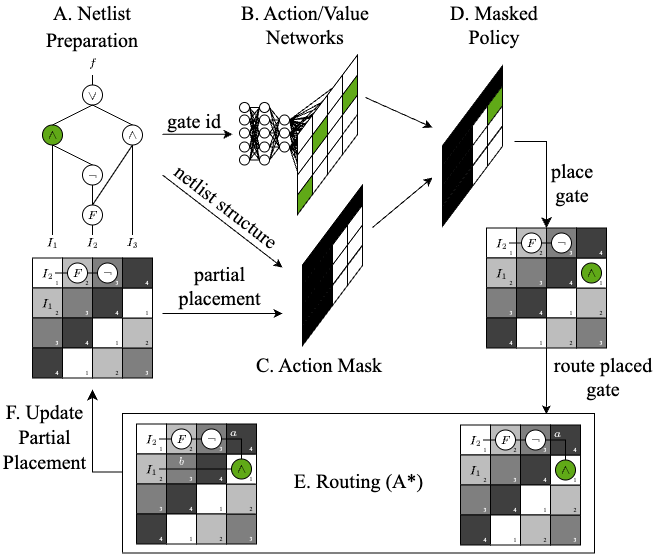

[![License: MIT][mit-badge]](https://opensource.org/licenses/MIT)
[![Code style: black][black-badge]][black-link]

# NanoPlaceR: Placement and Routing for Field-coupled Nanocomputing (FCN) based on Reinforcement Learning

<p align="center">
  <picture>
    <source media="(prefers-color-scheme: dark)" srcset="images/mnt_light.svg" width="60%">
    
  </picture>
</p>

NanoPlaceR is a tool for the physical design of FCN circuitry based on Reinforcement Learning.
It can generate layouts for logic networks up to ~200 gates, while requiring ~50% less area than the state-of-the-art heuristic approach.

Inspired by recent developments in the field of machine learning-aided design automation, this tool combines reinforcement learning with efficient path routing algorithms based on established algorithms such as A\* search.
Masked Proximal Policy Optimization (PPO) is used to learn the placement of logic elements, which is further accelerated by incorporating an action mask computed based on the netlist structure and the last partial placement, ensuring valid and compact solutions.
To minimize the occurrence of unpromising partial placements, several checks constantly ensure the early termination of sub-par solutions.
Furthermore, the routing of placed gates is incorporated directly into the placement step using established routing strategies.
The following figure outlines the methodology:



# Usage of NanoPlaceR

Currently, due to the Open-AI gym dependency, only python versions up to 3.10 are supported.

If you do not have a virtual environment set up, the following steps outline one possible way to do so.
First, install virtualenv:

```console
$ pip install virtualenv
```

Then create a new virtual environment in your project folder and activate it:

```console
$ mkdir nano_placement
$ cd nano_placement
$ python -m venv venv
$ source venv/bin/activate
```

NanoPlaceR heavily depends on fiction, whose python binding currently has to be installed from source (will be available as a python package in the future).
To install fiction and build it, run the following commands:

```console
(venv) $ git clone -b pyml --single-branch --recursive https://github.com/marcelwa/fiction.git
(venv) $ cd fiction
(venv) $ pip install .
(venv) $ cd ..
```

After successfully installing pyfiction, clone this repository and install the dependencies:

```console
(venv) $ git clone https://github.com/cda-tum/NanoPlaceR.git
(venv) $ cd NanoPlaceR
(venv) $ pip install -r requirements.txt
```

To register the environment, install the package locally:

```console
(venv) $ pip install -e .
```

You can either change the parameters (e.g. logic function, clocking scheme, layout width etc.) in `main.py` or simply use the tool in the command line.

```
(venv) $ python main.py -h
usage: main.py [-h] [-b {fontes18,trindade16,EPFL,TOY,ISCAS85}] [-f FUNCTION] [-c {2DDWave,USE, RES}] [-t {QCA,SiDB}] [-l] [-lw LAYOUT_WIDTH] [-lh LAYOUT_HEIGHT] [-ts TIME_STEPS] [-r] [-v {0,1}]


Optional arguments:
  -h, --help                       Show this help message and exit.
  -b, --benchmark                  Benchmark set.
  -f, --function                   Logic function to generate layout for.
  -c, --clocking_scheme            Underlying clocking scheme.
  -t, --technology                 Underlying technology (QCA or SiDB).
  -l, --minimal_layout_dimension   If True, experimentally found minimal layout dimensions are used.
  -lw, --layout_width              User defined layout width.
  -lh, --layout_height             User defined layout height.
  -ts, --time_steps                Number of time steps to train the RL agent.
  -r,  --reset_model               If True, reset saved model and train from scratch.
  -v,  --verbosity                 0: No information. 1: Print layout after every new best placement. 2: Print training metrics. 3: 1 and 2 combined.
```

# Repository Structure

```
.
├── benchmarks/                       # common benchmark sets
├── images/                           # generated layouts in .svg format are saved here
├── models/                           # ppo models
├── placement_envs/
│ ├── envs/
│   └── nano_placement_env/           # placement environment
│ ├── utils/
│   └── placement_utils/              # placement util functions
│   └── layout_dimenions/             # predefined layout dimensions for certain functions
├── ppo_masked/                       # ppo mask implementation adapted from sb3-contrib
├── tensorboard/                      # tensorboard log directory
```

# Monitoring Training

Training can be monitored using [Tensorboard](https://www.tensorflow.org/tensorboard).

Install it via

```console
(venv) $ pip install tensorboard
```

and run the following command from within the NanoPlaceR directory:

```console
(venv) $ cd NanoPlaceR
(venv) $ tensorboard --logdir="tensorboard/{Insert function name here}"
```

# References

In case you are using NanoPlaceR in your work, we would be thankful if you referred to it by citing the following publication:

```bibtex
@INPROCEEDINGS{hofmann2023nanoplacer,
  author        = {S. Hofmann and M. Walter and L. Servadei and R. Wille},
  title         = {{Late Breaking Results From Hybrid Design Automation for Field-coupled Nanotechnologies}},
  booktitle     = {{Design Automation Conference (DAC)}},
  year          = {2023},
}
```

[mit-badge]: https://img.shields.io/badge/license-MIT-blue.svg?style=flat-square
[black-badge]: https://img.shields.io/badge/code%20style-black-000000.svg
[black-link]: https://github.com/psf/black
